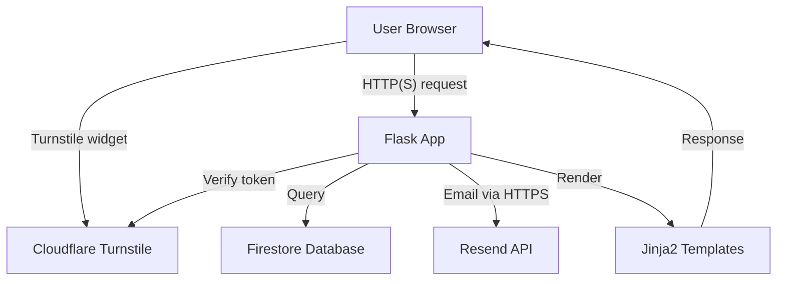
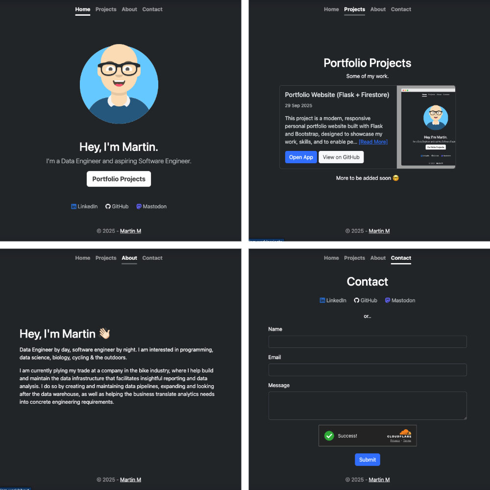

# Portfolio Website (Flask + Firestore)

This project is a modern, responsive personal portfolio website built with Flask and Bootstrap, designed to showcase my work, skills, and to enable people to get in touch with me.  
It features dynamic project data sourced from Google Firestore, a secure contact form with bot protection, and a clean, professional UI.

Link: https://www.martinm.work/

---

## Features

- **Responsive Design:**  
  Built with Bootstrap 5 for seamless experience across devices.
- **Dynamic Portfolio:**  
  Projects are stored in Firestore and displayed dynamically on the site.
- **Project Detail Pages:**  
  Each project has its own detail page, accessible via a unique URL.
- **Contact Form:**  
  Bot-protected with Cloudflare Turnstile and delivered via the Resend HTTP API.
- **Accessibility:**  
  Uses ARIA attributes and semantic HTML for improved accessibility.
- **Security:**  
  Security headers (CSP, X-Frame-Options, X-Content-Type-Options), CSRF protection, and sanitized Markdown.
- **Professional UI:**  
  Custom theming, social media integration, and interactive elements.
- **Deployment:**  
  Hosted on Railway with a custom domain.

---

## Skills Showcased

- **Python & Flask:**  
  Routing, templating, context processors, error handling, and form validation.
- **Google Cloud Firestore:**  
  NoSQL database integration, authentication, and data retrieval.
- **Bootstrap 5:**  
  Responsive layouts, utility classes, and component customization.
- **Jinja2 Templating:**  
  Dynamic content rendering and conditional logic.
- **Email Delivery:**  
  Resend HTTP API integration with user feedback via flash messages.
- **Bot Protection & Security:**  
  Cloudflare Turnstile, CSRF, CSP, and content sanitization.
- **Environment Management:**  
  Use of `python-dotenv` and environment-driven configuration.
- **Logging & Error Handling:**  
  Professional logging and user-facing error messages.

---

## Architecture Diagram
A visual architecture diagram is included below to illustrate the core workflows and infrastructure.

**Architecture Diagram**

---

## Summary

This portfolio demonstrates full‑stack web development skills, cloud database integration, secure form handling with bot protection, and modern UI/UX practices.  
It’s a production‑ready showcase of both technical and design capabilities.

## Screenshots
