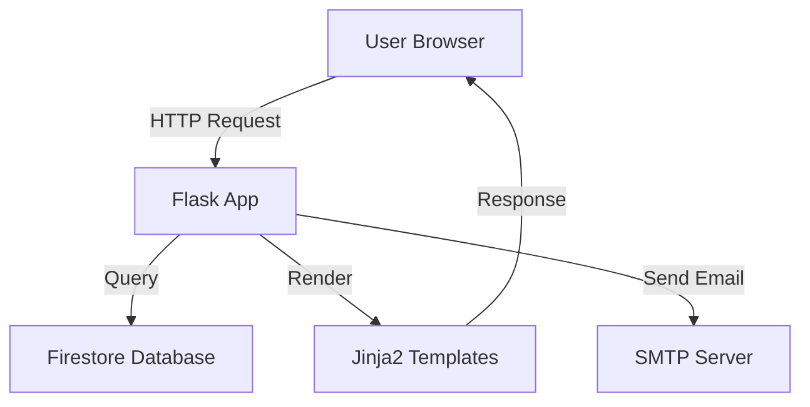

# Personal Portfolio Website (Flask + Firestore)

This project is a modern, responsive personal portfolio website built with Flask and Bootstrap, designed to showcase my work, skills, and to enable people to get in touch with me.  
It features dynamic project data sourced from Google Firestore, a secure contact form with email integration, and a clean, professional UI.

---

## Features

- **Responsive Design:**  
  Built with Bootstrap 5 for seamless experience across devices.
- **Dynamic Portfolio:**  
  Projects are stored in Firestore and displayed dynamically on the site.
- **Project Detail Pages:**  
  Each project has its own detail page, accessible via a unique URL.
- **Contact Form:**  
  Secure contact form with email validation and Flask-Mail integration.
- **Accessibility:**  
  Uses ARIA attributes and semantic HTML for improved accessibility.
- **Security:**  
  Sensitive credentials managed via environment variables and `.env` files.
- **Professional UI:**  
  Custom theming, social media integration, and interactive elements.

---

## Skills Showcased

- **Python & Flask:**  
  Routing, templating, context processors, error handling, and form validation.
- **Google Cloud Firestore:**  
  NoSQL database integration, authentication, and data retrieval.
- **Bootstrap 5:**  
  Responsive layouts, utility classes, and component customization.
- **Jinja2 Templating:**  
  Dynamic content rendering and conditional logic.
- **Email Integration:**  
  Flask-Mail setup, secure SMTP configuration, and user feedback via flash messages.
- **Environment Management:**  
  Use of `python-dotenv` for secure configuration.
- **Logging & Error Handling:**  
  Professional logging and user-facing error messages.
- **Version Control:**  
  Proper use of `.gitignore` to protect sensitive files.

---

## Architecture Diagram

Including a flow chart or architecture diagram is highly recommended.  
It could illustrate:

- User request flow (from browser to Flask routes)
- Firestore data retrieval
- Email sending process
- Template rendering and flash messaging

Sample Architecture Diagram (click to expand)

---

## Summary

This portfolio demonstrates full-stack web development skills, cloud database integration, secure form handling, and modern UI/UX practices.  
It’s a production-ready showcase of both technical and design capabilities.

---
